# FigBridge AI 开发方向与现存代码讲解文档

> 用途：答辩讲解材料。目标不是逐行讲代码，而是把 FigBridge 讲成一个“AI 参与、工程兜底、结果可复用”的设计转代码工作流。

## 1. 一句话定位

FigBridge 是一个 macOS 原生 SwiftUI 工作台，用来把 Figma 设计稿转成稳定的 DesignIR 中间表示，并进一步进入资源导出、批次管理、离线设计包、Harmony/ArkUI 生成等流程。

答辩时可以这样讲：

> FigBridge 的核心不是“让 AI 随便生成一段代码”，而是把 Figma 到研发落地这条链路做成一个可控工作流。AI 负责理解和补全，工具负责拿数据、约束格式、校验结果、保存证据、沉淀复用。

这句话里包含三层价值：

- 价值：降低设计稿转代码过程中的人工整理成本和模型不确定性。
- 作用：把 Figma、Agent、DesignIR、资源、批次、Harmony 生成串成可执行链路。
- 成果：已经形成可运行的桌面 App、核心服务、设计包契约、生成器、测试与 CI 门禁。

## 2. AI 开发方向怎么讲

### 2.1 我对 AI 开发的判断

在这个项目里，AI 不是替代工程逻辑的黑盒，而是被放在一个明确边界内使用。

可以讲成三句话：

1. AI 适合处理设计稿理解、结构补全、命名归纳、异常布局解释这类非完全确定的问题。
2. AI 不适合直接成为最终产物的唯一来源，因为自由文本输出会带来格式不稳定、资源路径不稳定、结果不可复现的问题。
3. 所以 FigBridge 的方向是“AI + 工程约束”：先用工具把上下文准备好，再让 AI 输出结构化 DesignIR，最后由代码负责解析、校验、持久化和确定性生成。

这能体现你的判断力：你不是简单说“我用了 AI”，而是知道 AI 放在哪里最有价值，也知道哪里必须由工程系统兜底。

### 2.2 AI 在 FigBridge 中的角色

FigBridge 里的 AI 主要承担四类角色。

第一类是结构理解：

- 根据 Figma 节点、预览、资源、局部 DesignIR seed，理解页面结构。
- 把视觉信息转换为布局、文本、颜色、资源引用、节点层级。

第二类是语义补全：

- 对 Figma 中无法直接稳定映射的内容补充说明。
- 例如交互意图、复杂节点、低置信度布局、需要人工复核的地方。

第三类是格式化输出：

- 输出严格的 DesignIR JSON 或 YAML。
- 不允许输出解释性 Markdown、代码块、额外说明。

第四类是未来内网适配：

- 通过 OpenAI-compatible HTTP provider 接入内网模型服务或 MiniMax 网关。
- 让同一条工作流既能支持本地 CLI Agent，也能支持 HTTP 模型接口。

答辩口播：

> 我没有让 AI 直接生成最终项目代码，而是让 AI 输出一个中间层 DesignIR。这个中间层包含页面、节点、布局、样式、资源、warnings 和 needsReview。这样 AI 的结果可以被程序校验，也可以被后续 ArkUI 生成器继续消费。

### 2.3 为什么需要 DesignIR 中间层

直接让 AI 从 Figma 链接生成 ArkUI 代码有几个问题：

- Figma 链接依赖外部访问，内网环境不稳定或不可用。
- AI 输出代码时容易夹杂解释、Markdown、路径错误、资源缺失。
- 同一张设计稿多次生成可能结果不同。
- 生成失败后很难定位是 Figma 数据问题、Prompt 问题、模型问题还是代码生成问题。

DesignIR 的作用是把链路拆开：

```text
Figma 数据 -> DesignIR -> 设计包 -> Harmony/ArkUI 代码
```

这样每一步都有明确责任：

- FigmaService 负责获取和缓存设计上下文。
- Agent 负责把上下文整理成 DesignIR。
- AgentGenerationResultParser 负责解析和规范化输出。
- DesignIRValidator 负责校验结构。
- DesignPackageStore 负责离线包和 checksum。
- ArkUIGenerator / HarmonyProjectGenerator 负责确定性代码生成。

答辩口播：

> DesignIR 是这个项目的关键沉淀。它把 AI 的自然语言能力变成工程可以校验的数据结构，也把一次性的模型输出变成可存储、可导入、可追溯、可继续生成的资产。

### 2.4 当前 AI 链路

当前生成链路可以这样讲：

```mermaid
flowchart LR
    A["用户输入 Figma design 链接"] --> B["FigmaLinkParser 解析 fileKey 和 nodeId"]
    B --> C["FigmaService 拉取节点 JSON、预览图、资源"]
    C --> D["FigmaNodeToDesignIRMapper 生成本地 DesignIR seed"]
    D --> E["PromptBuilder 注入本地上下文和严格输出规则"]
    E --> F["AgentService 调用 Claude CLI / Codex CLI / HTTP Provider"]
    F --> G["GenerationCoordinator 保存 agent-output.txt"]
    G --> H["AgentGenerationResultParser 解析与规范化"]
    H --> I["DesignIRValidator 校验"]
    I --> J["保存 design-ir/design.json 并更新批次"]
```



这里可以重点强调“本地 Figma 上下文”：

- 旧方案容易要求 Agent 自己调用 Figma MCP。
- 当前项目已经把 Figma 获取责任前移到 FigBridge。
- Prompt 明确要求 Agent 不要再调用 Figma MCP，而是使用 FigBridge 提供的本地上下文。

答辩口播：

> 这个调整很重要。以前模型如果拿不到 Figma MCP，就会直接失败。现在 FigBridge 先通过 Figma REST API 把节点、预览、资源、本地 DesignIR seed 缓存下来，再把这些信息交给 Agent。这样模型不再依赖外部 MCP，链路更稳，也更适合后续内网化。

### 2.5 Provider 抽象和内网 AI 接口方向

当前 `AgentProviderKind` 支持三类 provider：

- `claudeCLI`：调用本机 Claude CLI。
- `codexCLI`：调用本机 Codex CLI。
- `openAICompatibleHTTP`：调用兼容 OpenAI Chat Completions 协议的 HTTP 接口。

这部分要讲出“方向感”：

> 我在 provider 设计上没有把项目绑定到某一个模型或某一个命令行工具，而是保留 CLI Agent，同时扩展了 OpenAI-compatible HTTP。这样后续如果公司内网统一模型服务、MiniMax 私有网关或其他兼容接口可用，FigBridge 不需要推翻业务链路，只需要配置 provider。

技术点：

- `AgentService` 统一暴露 `runDetailed(provider:prompt:eventHandler:)`。
- CLI provider 会走 `ShellClient`，并记录 executable、arguments、stdout、stderr、exitCode。
- HTTP provider 会请求 `/chat/completions`，支持普通 JSON 响应和 streaming。
- 运行事件通过 `AgentRunEvent` 回传给 UI，形成实时日志。

这能体现你的 AI 开发方向不是“换模型”，而是“模型能力可插拔，工程链路稳定”。

### 2.6 AI 输出质量控制

AI 输出不可控，所以项目里做了几层约束。

第一层：Prompt 约束

- 要求输出严格 DesignIR JSON/YAML。
- 要求字段齐全。
- 要求 `tokens.colors` 必须是数组。
- 要求 `asset.localPath` 必须是 package-relative 路径。
- 禁止 Markdown、解释文字、额外字段。

第二层：Parser 兼容和修正

- 支持 JSON 和 YAML。
- 支持单个外层代码块包裹的 DesignIR。
- 规范化常见 token 形态错误。
- 规范化 node type alias、fontWeight、padding、asset path。
- 对混杂解释、多代码块、空输出、结构不合法继续判失败。

第三层：Validator 强校验

- 校验 version、screenName、fileKey、nodeId。
- 校验 viewport 正数。
- 校验 rootNode 必须是 frame。
- 校验 node id 不重复。
- 校验 confidence 在 0 到 1。
- 校验资源路径必须安全且位于 assets 目录。

第四层：证据保留

- 原始输出保存为 `agent-output.txt`。
- 规范化后的 DesignIR 保存为 `design-ir/design.json`。
- 运行过程保存 run log。
- 批次可以导入导出，便于复盘和问题定位。

答辩口播：

> AI 输出不是直接被信任的。FigBridge 会先保留原始输出，再解析成 DesignIR，经过校验后才标记成功。如果失败，也会保留失败原因和原始输出，方便定位是模型输出问题、资源问题还是 schema 问题。

## 3. 现存代码怎么讲

### 3.1 工程结构

当前项目是 Swift Package Manager 工程，目标平台是 macOS 12+，语言模式是 Swift 6。

主要分成两个 target：

- `FigBridgeCore`：核心领域逻辑和服务。
- `FigBridgeApp`：SwiftUI App、页面和 ViewModel。

还有一个测试 target：

- `FigBridgeTests`：覆盖核心服务、生成链路、UI ViewModel、设计包、Harmony 生成、打包和质量门禁。

讲解时可以这样过渡：

> 我把业务逻辑尽量放在 Core 里，App 只负责界面展示和状态编排。这样核心链路可以脱离 UI 做单元测试，也方便后续扩展 CLI、内网工具或自动化流程。

### 3.2 Core 层主要职责

`Sources/FigBridgeCore` 里可以按能力讲，不需要逐文件背。

#### 3.2.1 模型层

核心文件：

- `Models.swift`
- `DesignPackage.swift`
- `FigmaNode.swift`

主要模型：

- `AgentProvider`：描述 Claude、Codex、HTTP provider。
- `AppSettings`：保存 token、provider、prompt、默认生成模式等设置。
- `FigmaLinkItem`：表示一条 Figma 链接任务。
- `GenerationBatch`：表示一次批次生成。
- `DesignIR`：设计中间表示。
- `DesignNode`：设计节点树。
- `DesignTokenSet`：颜色、文本、间距、圆角 token。
- `DesignPackageManifest`：离线设计包清单。

答辩口播：

> 模型层的核心是 DesignIR。它不是 UI 展示模型，而是跨阶段的数据契约。前面 Figma 抽取和 AI 生成都要落到这个结构，后面 Harmony 生成也消费这个结构。

#### 3.2.2 Figma 数据层

核心文件：

- `FigmaLinkParser.swift`
- `FigmaService.swift`
- `FigmaNodeToDesignIRMapper.swift`
- `LocalDesignResourceResolver.swift`
- `DesignIRAssetPathNormalizer.swift`

职责：

- 解析 Figma design 链接里的 `fileKey` 和 `nodeId`。
- 调用 Figma REST API 获取节点 JSON、预览图、图片资源。
- 缓存预览和资源到本地 item 目录。
- 把 Figma 节点映射成初步 DesignIR seed。
- 根据节点名、imageRef、语义颜色库解析本地资源和 token。

关键产物：

```text
items/<item-id-node-id>/
├── assets/
│   ├── preview.png
│   └── ...
└── figma-context/
    ├── figma-node.json
    └── figma-derived-design-ir.json
```

答辩口播：

> FigmaService 的价值是把“模型临时去拿 Figma 信息”改成“应用先把 Figma 上下文拿下来并缓存”。这让后续 AI 调用有本地依据，也能在失败时复查原始节点和资源。

#### 3.2.3 Agent 调用层

核心文件：

- `AgentService.swift`
- `ShellClient.swift`

职责：

- 检测本机 Claude / Codex 是否可用。
- 支持 GUI App 环境下的可执行文件查找。
- 调用 CLI provider。
- 调用 OpenAI-compatible HTTP provider。
- 支持 streaming 日志事件。
- 处理超时、退出码、stderr、空输出。

答辩口播：

> AgentService 是 AI 能力入口，但它不绑定具体模型。现在可以走 Claude CLI、Codex CLI，也可以走兼容 OpenAI 的 HTTP 接口。这个设计是为了让 AI 能力可替换，业务链路不被某一个模型绑死。

#### 3.2.4 生成协调层

核心文件：

- `GenerationCoordinator.swift`
- `AgentGenerationResultParser.swift`

职责：

- 根据模式选择逐个生成、并发生成或批量单次调用。
- 为每个 item 构造 prompt。
- 注入本地 Figma 上下文。
- 保存原始 agent 输出。
- 解析 DesignIR。
- 校验并写入 `design-ir/design.json`。
- 处理取消、失败、重试和已完成结果恢复。

生成策略：

- `sequential`：逐个生成，稳定、容易定位问题。
- `parallel`：并发生成，提高多链接处理效率。
- `singlePerLink`：每个链接一次 Agent 调用。
- `singleForBatch`：多链接一次 Agent 调用，再按分段拆回每个 item。

答辩口播：

> GenerationCoordinator 是整个 AI 链路的中枢。它不是简单调用模型，而是负责把输入、上下文、Prompt、模型输出、解析、校验、持久化串起来。尤其是批量单次调用，可以减少多链接场景下的模型调用次数，同时用分段协议保证每个链接的结果能对应回原任务。

#### 3.2.5 批次和持久化层

核心文件：

- `BatchStore.swift`
- `BatchArchiveStore.swift`
- `BatchImporterExporter.swift`
- `BatchPathRebaser.swift`
- `BatchAssetArchiver.swift`

职责：

- 创建、扫描、加载、更新批次。
- 保存 `batch.json`、`meta.json`、`source-input.txt`。
- 保存每个 item 的 DesignIR、agent output、预览图、资源。
- 支持批次重命名、删除、导入目录、导入 Zip、导出 Zip。
- 处理路径从绝对路径到批次相对路径的转换。
- 把外部资源归档到批次目录，保证导出包可迁移。

答辩口播：

> 批次层解决的是可追溯和可复用问题。模型生成不是一次性聊天结果，而是会落盘成为一个批次。后续可以重新打开、继续编辑、导出给别人、或者导入到另一台机器继续处理。

#### 3.2.6 离线设计包和 Harmony 生成

核心文件：

- `DesignPackage.swift`
- `ArkUIGenerator.swift`
- `HarmonyProjectGenerator.swift`

设计包结构：

```text
figbridge-package/
├── manifest.json
├── design.json
├── figma-node.json
├── preview.png
└── assets/
```

设计包校验：

- schema version。
- manifest 路径安全。
- SHA-256 checksum。
- design 与 manifest 的 fileKey、nodeId、targetPlatform 一致。
- asset 引用真实存在。

Harmony 生成：

- `ArkUIGenerator` 把 DesignIR 节点映射成 ArkUI 组件。
- `HarmonyProjectGenerator` 写入 `.ets` 页面。
- 图片资源复制到 `entry/src/main/resources/base/media`。
- 输出 `figbridge-harmony-report.md`。
- warnings 和 needsReview 会进入报告，提醒人工检查。

答辩口播：

> 内网场景下，Figma 和外网模型不一定可用，所以我把链路设计成两阶段。外网阶段生成离线设计包，内网阶段导入设计包并用确定性规则生成 Harmony/ArkUI 文件。AI 参与理解，但最终代码生成尽量由规则完成，这样更稳定。

### 3.3 App 层主要职责

`Sources/FigBridgeApp` 是 SwiftUI App 和 MVVM 状态管理。

#### 3.3.1 三个主要页面

`GeneratePage.swift`：生成页

- 选择 Agent。
- 编辑 Prompt。
- 输入多行 Figma 链接。
- 设置逐个/并发、单链接/批量调用。
- 添加链接后预加载资源。
- 点击生成后展示进度、运行日志、DesignIR。
- 支持取消、导出预览图、导出资源。

`ViewerPage.swift`：查看页

- 扫描批次。
- 查看批次详情、Prompt、条目。
- 查看预览、资源、运行日志、DesignIR。
- 导入目录、导入 Zip、导出批次。
- 批次重命名、删除、继续编辑。
- 导入设计包并生成 Harmony 项目。

`SettingsPage.swift`：设置页

- 保存 Figma Token。
- 测试 Token。
- 配置默认 Prompt。
- 配置默认输出目录。
- 配置 provider。
- 自动保存设置。

答辩口播：

> App 层不是简单把按钮堆起来，而是围绕三个工作流组织：生成、查看、设置。生成页负责生产结果，查看页负责管理和复用结果，设置页负责把外部依赖配置化。

#### 3.3.2 ViewModel 和状态编排

核心文件：

- `ViewModels.swift`
- `GenerationSessionController.swift`
- `ResourceLoadController.swift`
- `WorkspaceDraftCoordinator.swift`
- `GenerateWorkspaceDraftStore.swift`
- `RunLogReducer.swift`

职责：

- `SettingsViewModel` 管理设置、Agent 刷新、Token 测试。
- `GenerateViewModel` 管理生成工作区、输入、选择、生成、取消、日志、草稿。
- `ViewerViewModel` 管理批次扫描、导入导出、设计包、Harmony 生成。
- `WorkspaceDraftCoordinator` 保存当前工作区草稿，避免用户重启后丢失上下文。
- `RunLogReducer` 把 streaming event 整理成 UI 可展示日志。

答辩口播：

> 我在 App 层主要做状态编排，核心业务仍然落在 Core。比如生成、解析、批次写盘都在 Core 中完成，ViewModel 负责把这些能力组织成用户可以操作的流程。

## 4. 代码链路详细讲解

### 4.1 从 Figma 链接到任务列表

输入支持：

- 单个 `@url`。
- `描述: @url`。
- 多行混合输入。
- 自动按 `fileKey + nodeId` 去重。
- 自动规范化 `node-id`。

讲解重点：

> 这里看似是一个输入框，但它解决的是批量处理入口。设计师或研发可以一次粘贴多条 Figma 链接，系统会解析、去重、生成待处理任务。

### 4.2 从任务到 Figma 本地上下文

每个任务会触发资源加载：

- 请求 `/v1/files/<fileKey>/nodes` 获取节点。
- 请求 `/v1/images/<fileKey>` 获取预览。
- 请求 `/v1/files/<fileKey>/images` 获取图片资源。
- 下载预览和资源。
- 保存原始节点 JSON。
- 映射出初步 DesignIR seed。

讲解重点：

> 这个阶段的价值是把外部 Figma 信息变成项目本地资产。后面即使 Agent 失败，也能看到节点数据、预览图、资源和 seed，方便排查。

### 4.3 从本地上下文到 Prompt

Prompt 由两部分组成：

- 用户或默认 Prompt。
- FigBridge 强制追加的 DesignIR 输出契约。

契约里包含：

- 必须使用本地 Figma context。
- 不允许调用 Figma MCP。
- 必须输出 DesignIR。
- 必须包含固定顶层字段。
- 必须保持资源路径为 package-relative。
- 多链接场景必须使用分段标记。

讲解重点：

> 我没有完全依赖用户 Prompt，而是在系统里补充了一层强制契约。这样即使用户 Prompt 写得不完整，最终也会被拉回 DesignIR 输出规范。

### 4.4 从 Agent 输出到 DesignIR

Agent 输出分两份保存：

```text
design-ir/
├── agent-output.txt
└── design.json
```

- `agent-output.txt`：原始输出，便于排错。
- `design.json`：解析、规范化、校验后的 DesignIR。

讲解重点：

> 这是 AI 工程化的关键。成功不是模型有输出，而是输出能被解析、能被校验、能落盘、能被后续流程消费。

### 4.5 从 DesignIR 到 Harmony/ArkUI

ArkUI 生成映射：

- `vertical` -> `Column`
- `horizontal` -> `Row`
- `wrap` -> `Flex`
- `absolute` 或不明确布局 -> `Stack` 并输出 warning
- `text` -> `Text`
- `image/icon` -> `Image($r(...))`
- fill、cornerRadius、opacity、border、fontSize、fontColor 等转成 ArkUI modifier

讲解重点：

> 最终代码生成尽量是确定性规则，而不是再让 AI 自由发挥。这样可以减少不可控输出，也方便通过测试保障相同输入生成相同结果。

## 5. 测试和质量门禁怎么讲

当前测试覆盖的重点包括：

- 链接解析。
- Agent 调用参数。
- HTTP provider。
- Prompt 和本地 Figma context。
- DesignIR parser。
- FigmaService 资源缓存。
- FigmaNodeToDesignIRMapper。
- GenerationCoordinator 顺序、并发、批量调用、失败保留、取消恢复。
- BatchStore 持久化、导入导出、路径 rebasing。
- DesignPackage 校验、checksum、Zip 导入。
- ArkUIGenerator。
- HarmonyProjectGenerator。
- GenerateViewModel / ViewerViewModel / SettingsViewModel。
- App icon、打包 metadata。

当前仓库测试文件中有 146 个 `@Test func` 用例定义。

质量门禁脚本是：

```bash
./scripts/ci-checks.sh
```

门禁包含：

- 检查生成物和本地缓存是否误入仓库。
- 校验 JSON 语法。
- 执行 `git diff --check`。
- 执行 `swift build`。
- 执行 `swift test`。

GitHub Actions 会在 `pull_request` 以及 `master`、`feature-xjl-0522` push 时运行门禁。

答辩口播：

> 这个项目不是只有功能演示，也有质量兜底。AI 链路最容易出问题的地方，比如输出格式、资源路径、取消恢复、批量分段、HTTP provider，都有测试覆盖。CI 里也会统一跑构建、测试和基础检查。

## 6. 答辩演示顺序

### 6.1 推荐 5 分钟演示

第一步：设置页

讲：

> 这里配置 Figma Token、Agent 和默认 Prompt。它说明这个工具不是写死在某个模型上，而是把外部能力配置化。

第二步：生成页

讲：

> 这里输入 Figma 链接，系统会解析成待处理任务。添加后会加载预览和资源，生成时可以选择逐个、并发或批量单次调用。

第三步：展示详情

讲：

> 右侧可以看到预览、资源状态、生成状态、运行日志和 DesignIR。这里体现的是可观测性，不是黑盒生成。

第四步：查看页

讲：

> 生成结果会保存为批次，可以重新打开、继续编辑、导出 Zip、导入到其他环境。这样模型输出被沉淀成可复用资产。

第五步：Harmony/设计包

讲：

> 对内网场景，后续可以导入离线设计包，再生成 Harmony/ArkUI 文件和报告，减少对外网模型和 Figma 实时访问的依赖。

### 6.2 推荐 10 分钟讲解结构

1. 背景问题：Figma 到代码链路分散，AI 输出不稳定。
2. 总体方案：Figma 本地上下文 + AI 结构化输出 + DesignIR 校验 + 批次持久化 + Harmony 生成。
3. AI 开发方向：AI 不直接接管最终产物，而是作为结构理解和补全能力。
4. 代码架构：Core 和 App 分层。
5. 核心链路：FigmaLinkParser -> FigmaService -> PromptBuilder -> AgentService -> Parser -> Validator -> BatchStore。
6. 成果展示：生成页、查看页、设置页、导入导出、运行日志。
7. 质量保障：146 个测试定义、CI 门禁、`scripts/ci-checks.sh`。
8. 后续方向：更完整 Figma 映射、内网 HTTP provider、资源库匹配、Harmony 构建验证。

## 7. 直接可用口播稿

### 7.1 开场

> 我这部分主要讲 FigBridge。它是我围绕 AI 开发方向做的一个 Figma 到研发落地工作台。  
> 这个项目的重点不是简单调用模型，而是把 AI 能力放进一个可控、可校验、可复用的工程流程里。

### 7.2 讲价值

> 以前从 Figma 到代码，中间会有很多人工动作：复制链接、截图、导资源、描述布局、让模型生成、再手工整理。这个过程成本高，而且模型输出经常不稳定。  
> FigBridge 的价值就是把这些分散动作串成一条链路：先拿到 Figma 的真实上下文，再让 AI 输出结构化 DesignIR，最后通过解析、校验、批次保存和后续生成把结果沉淀下来。

### 7.3 讲 AI 方向

> 我对 AI 开发的理解是，AI 最适合做理解和补全，但不应该直接成为最终结果的唯一依据。  
> 所以在 FigBridge 里，AI 输出不会被直接信任。它必须符合 DesignIR 契约，必须能被解析，必须能被校验，失败时还要保留原始输出和错误原因。  
> 这样 AI 的不确定性被限制在一个可控边界里，工程系统负责兜底。

### 7.4 讲代码架构

> 代码上我把项目分成 Core 和 App。Core 放核心业务，包括 Figma 服务、Agent 调用、生成协调器、DesignIR parser、批次存储、设计包、Harmony 生成。App 层负责 SwiftUI 页面和 ViewModel 状态编排。  
> 这样设计的好处是核心能力可以被测试，也方便后续接入 CLI、内网模型服务或者自动化流程。

### 7.5 讲核心链路

> 用户输入 Figma 链接后，FigmaLinkParser 会解析 fileKey 和 nodeId。FigmaService 再通过 Figma REST API 拉取节点、预览图和资源，并缓存到本地。  
> 然后系统会生成一个本地 DesignIR seed，把它和严格输出规则一起注入 Prompt。AgentService 调用 Claude、Codex 或 HTTP provider。  
> 模型输出后，GenerationCoordinator 会先保存原始 agent-output.txt，再交给 Parser 转成 DesignIR，最后由 Validator 校验并保存 design.json。只有走完这套流程，任务才算成功。

### 7.6 讲成果

> 当前成果包括三个层面。  
> 第一是用户侧工作台，已经有生成、查看、设置三个页面，可以处理多链接、资源预览、日志、导入导出和批次管理。  
> 第二是工程链路，已经有 DesignIR、设计包、Parser、Validator、Provider 抽象和 Harmony 生成器。  
> 第三是质量保障，当前测试覆盖链接解析、Agent 调用、生成协调、Figma 资源、批次存储、设计包和 ArkUI 生成，CI 也会运行构建和测试门禁。

### 7.7 讲后续规划

> 后续我会继续沿着“AI 能力工程化”的方向推进。第一，增强 Figma 到 DesignIR 的自动映射，减少纯 Prompt 依赖。第二，完善内网 HTTP provider，让它能接入公司内网模型服务。第三，强化资源库匹配，让图片和图标更稳定地从本地资产库解析。第四，增加 Harmony 项目级构建或静态检查，让生成结果不仅能看，还能进入实际工程验证。

## 8. 常见追问回答

### 8.1 为什么不直接让 AI 生成 ArkUI 代码？

回答：

> 直接生成代码看起来最快，但不稳定。因为模型可能输出 Markdown、遗漏资源、路径写错、布局不一致，而且失败后不好定位。  
> 我选择先生成 DesignIR，是为了让 AI 的结果变成可校验的数据结构，再由规则生成 ArkUI。这样链路更稳定，也更适合团队复用。

### 8.2 这个项目和普通 Prompt 工具有啥区别？

回答：

> 普通 Prompt 工具解决的是一次生成，FigBridge 解决的是工作流。它有 Figma 数据获取、资源缓存、Prompt 契约、输出解析、schema 校验、批次保存、导入导出和后续代码生成。  
> 所以它不是一次对话，而是可以沉淀结果、排查问题、继续迭代的工程系统。

### 8.3 AI 输出错误怎么办？

回答：

> 系统不会直接把错误输出当成功。原始输出会保存为 `agent-output.txt`，Parser 会尝试处理可恢复问题，比如单个代码块包裹、token 形态错误、fontWeight 类型差异。  
> 但如果混入解释文字、字段缺失、来源不匹配或结构无效，就会标记失败，并把原因展示出来。

### 8.4 内网环境怎么使用？

回答：

> 方向是两阶段。外网阶段负责读取 Figma、生成设计包；内网阶段导入设计包，用确定性规则生成 ArkUI。  
> 同时 provider 层已经支持 OpenAI-compatible HTTP，后续可以接公司内网模型服务或 MiniMax 网关，不需要重写整个业务链路。

### 8.5 你的个人价值体现在哪里？

回答：

> 我的价值不是只完成单点功能，而是把一个不稳定、依赖人工经验的流程沉淀成可复用工具。  
> 这里既有 AI 使用，也有工程约束、测试保障、批次持久化和后续内网适配方向。它可以降低重复成本，也能让团队在类似设计转代码场景中复用这套方法。

## 9. 演示时的注意事项

现场尽量不要把演示赌在实时模型生成上。

建议提前准备：

- 一个已经成功生成的批次。
- 一个可展示的 Figma 链接。
- 一个已经有预览图、资源、DesignIR 的 item。
- 一个能打开的批次目录或导出 Zip。
- 如果展示 Harmony，提前准备一个已导入的设计包或生成报告。

现场演示策略：

1. 可以现场粘贴链接，展示解析和资源加载。
2. 不一定等模型完整生成。
3. 重点切到已生成批次，展示结果、日志、DesignIR。
4. 如果网络或模型失败，直接说：

> 现场模型调用受网络和环境影响，我这里重点展示已经落盘的批次和可追溯产物。这个也正是 FigBridge 的设计目标：即使模型调用不稳定，历史结果、原始输出、DesignIR 和资源仍然可以继续查看和复用。

## 10. 结尾总结

可以用这一段收尾：

> 总结一下，FigBridge 做的是 AI 开发工作流工程化。它把 Figma 数据、AI 结构化生成、DesignIR 校验、批次持久化、离线设计包和 Harmony 生成串起来。  
> 这个项目对我的成长也比较明显：我不只是完成页面功能，而是在思考 AI 能力如何稳定进入研发流程，如何通过中间层、校验、日志和测试，把 AI 的不确定性转化成团队可以复用的工程资产。
