# FigBridge 答辩展示文档

## 1. 项目定位

FigBridge 是一个 macOS 原生 SwiftUI 工作台，用来把 Figma 设计稿转成稳定的 DesignIR 中间表示，并进一步进入资源导出、批次管理、离线设计包、Harmony/ArkUI 生成等流程。

它可以被定义为一个垂直场景下的 AI-assisted design-to-code workflow，也就是“AI 辅助的设计稿转代码工作流”。

它不是通用工作流引擎，而是围绕 Figma 到研发落地这一条具体链路，把多个原本分散的步骤组织成可执行、可追溯、可验证的工程流程。

答辩时可以这样介绍：

> FigBridge 的核心目标，是把 Figma 到研发落地这条链路做成一个可控工作流。AI 负责理解和补全，工具负责拿数据、约束格式、校验结果、保存证据。这样 AI 不再是一次性生成文本，而是被放进一个可以复用、可以排查、可以继续生成代码的工程流程中。

## 2. 价值、作用、成果

### 2.1 价值

降低设计稿转代码过程中的人工整理成本和模型不确定性。

在传统流程中，从 Figma 到代码往往需要人工复制链接、截图、导资源、描述布局、让模型生成、再手工整理结果。这个过程成本高，而且模型输出不稳定。

FigBridge 的价值在于：

- 减少人工整理 Figma 信息和资源的成本。
- 降低 AI 自由输出带来的格式不稳定。
- 把一次性的模型生成结果沉淀成可复用资产。
- 让设计稿到代码的过程可以被记录、校验和复盘。

### 2.2 作用

把 Figma、Agent、DesignIR、资源、批次、Harmony 生成串成一条可执行链路。

它在工作流中承担的作用是：

- 从 Figma 链接中解析 `fileKey` 和 `nodeId`。
- 拉取 Figma 节点 JSON、预览图和资源。
- 生成本地 DesignIR seed，给 AI 提供结构化上下文。
- 调用 Claude CLI、Codex CLI 或 HTTP Provider。
- 解析、规范化和校验 AI 输出。
- 保存原始输出、DesignIR、资源、日志和批次信息。
- 继续导出设计包或生成 Harmony/ArkUI 工程文件。

### 2.3 成果

当前已经形成以下成果：

- 一个可运行的 macOS SwiftUI 桌面 App。
- 一套核心服务，包括 Figma 数据获取、Agent 调用、生成协调、DesignIR 解析、批次存储。
- 一套 DesignIR 和设计包契约，用于把 AI 输出变成可校验的数据结构。
- 一套 Harmony/ArkUI 生成能力，用 DesignIR 继续生成 `.ets` 页面、资源文件和生成报告。
- 一套测试与 CI 门禁，用来保障核心链路持续可用。

答辩时可以概括为：

> 这个项目的成果不是单个页面功能，而是一条完整链路：从 Figma 输入，到 AI 结构化生成，再到 DesignIR 校验、批次保存、离线包和 Harmony 生成。它把 AI 能力工程化成了一个稳定 workflow。

## 3. Workflow 总览

FigBridge 的整体工作流如下：

```mermaid
flowchart LR
    A["用户输入 Figma design 链接"] --> B["FigmaLinkParser 解析 fileKey 和 nodeId"]
    B --> C["FigmaService 拉取节点 JSON、预览图、资源"]
    C --> D["FigmaNodeToDesignIRMapper 生成本地 DesignIR seed"]
    D --> E["PromptBuilder 注入本地上下文和严格输出规则"]
    E --> F["AgentService 调用 Claude CLI / Codex CLI / HTTP Provider"]
    F --> G["GenerationCoordinator 保存 agent-output.txt"]
    G --> H["AgentGenerationResultParser 解析与规范化"]
    H --> I["DesignIRValidator 校验"]
    I --> J["保存 design-ir/design.json 并更新批次"]
```



这条链路可以拆成四段理解：

1. 数据准备：从 Figma 链接获取节点、预览和资源。
2. AI 生成：把本地上下文和严格规则注入 Prompt，调用 Agent 输出 DesignIR。
3. 工程校验：保存原始输出，解析、规范化、校验 DesignIR。
4. 结果沉淀：保存批次、资源、日志，并进入设计包或 Harmony/ArkUI 生成。

## 4. AI 开发方向

FigBridge 对 AI 的使用不是“完全依赖模型直接写代码”，而是“AI + 工程约束”。

### 4.1 AI 适合做什么

AI 适合处理以下非完全确定的问题：

- 设计稿结构理解。
- 页面层级补全。
- 组件和资源命名归纳。
- 复杂布局解释。
- 异常节点说明。
- 交互意图和人工复核点补充。

这些问题很难完全靠规则穷举，但 AI 可以根据上下文做合理推断。

### 4.2 AI 不适合直接做什么

AI 不适合直接成为最终产物的唯一来源。

原因是：

- 自由文本输出容易夹杂解释、Markdown 或代码块。
- 资源路径可能错误。
- 字段可能缺失。
- 同一输入多次生成可能结果不一致。
- 失败后难以判断问题来自 Figma、Prompt、模型还是代码生成。

### 4.3 FigBridge 的 AI 使用原则

FigBridge 的原则是：

```text
先由工具准备上下文
再由 AI 输出结构化 DesignIR
最后由代码负责解析、校验、持久化和确定性生成
```

答辩时可以这样讲：

> 我没有让 AI 直接生成最终工程代码，而是让 AI 生成 DesignIR。DesignIR 是一个结构化中间层，里面包含页面、节点、布局、样式、资源和 warnings。这样 AI 的结果可以被程序解析和校验，也可以被后续 ArkUI 生成器继续消费。

## 5. 为什么需要 DesignIR 中间层

直接让 AI 从 Figma 链接生成 ArkUI 代码会遇到几个问题：

- Figma 链接依赖外部访问，内网环境不稳定或不可用。
- AI 输出代码时容易夹杂解释、Markdown、路径错误或资源缺失。
- 同一张设计稿多次生成可能结果不同。
- 生成失败后很难定位是 Figma 数据问题、Prompt 问题、模型问题还是代码生成问题。

DesignIR 的作用是把链路拆开：

```text
Figma 数据 -> DesignIR -> 设计包 -> Harmony/ArkUI 代码
```

拆开之后，每一步都有明确责任：

- `FigmaService`：获取和缓存设计上下文。
- `Agent`：根据上下文整理出 DesignIR。
- `AgentGenerationResultParser`：解析和规范化 AI 输出。
- `DesignIRValidator`：校验结构是否合法。
- `DesignPackageStore`：负责离线包、manifest 和 checksum。
- `ArkUIGenerator` / `HarmonyProjectGenerator`：负责确定性代码生成。

答辩时可以这样讲：

> DesignIR 是这个项目最关键的工程沉淀。它把 AI 的自然语言能力转成可校验的数据结构，也把一次性模型输出变成可存储、可导入、可追溯、可继续生成代码的资产。

## 6. 关键模块职责

### 6.1 FigmaLinkParser

负责从用户输入中解析 Figma design 链接，提取 `fileKey` 和 `nodeId`，并对重复链接去重。

讲解重点：

> 它是整个 workflow 的入口，把用户粘贴的多行 Figma 链接转换成系统可以处理的任务列表。

### 6.2 FigmaService

负责调用 Figma REST API，获取节点 JSON、预览图和图片资源，并缓存到本地。

讲解重点：

> 它把外部 Figma 数据前置到 FigBridge 内部，避免后续完全依赖 Agent 自己访问 Figma。

### 6.3 FigmaNodeToDesignIRMapper

负责把 Figma 节点初步映射成本地 DesignIR seed。

讲解重点：

> 这个 seed 是给 AI 的结构化参考，减少模型凭空推断，也让生成结果更贴近真实 Figma 数据。

### 6.4 PromptBuilder

负责把用户 Prompt、本地 Figma 上下文、严格 DesignIR 输出规则合并成最终 Prompt。

讲解重点：

> 它保证即使用户 Prompt 不完整，系统也会强制补充 DesignIR 输出契约。

### 6.5 AgentService

负责统一调用 AI 能力，目前支持 Claude CLI、Codex CLI 和 OpenAI-compatible HTTP Provider。

讲解重点：

> 它让模型能力可插拔。后续如果要接公司内网模型服务或 MiniMax 网关，不需要推翻主链路。

### 6.6 GenerationCoordinator

负责组织生成过程，包括逐个生成、并发生成、批量单次调用、保存原始输出、处理失败和取消恢复。

讲解重点：

> 它是 AI 工作流的调度中枢，确保模型调用不是孤立动作，而是进入可追踪、可恢复、可持久化的流程。

### 6.7 AgentGenerationResultParser

负责解析 AI 输出，并处理常见可恢复问题，例如单个代码块包裹、token 形态错误、字体权重格式差异等。

讲解重点：

> 这里体现的是对 AI 输出不稳定性的工程兜底。可恢复的问题尽量规范化，真正不合法的内容继续判失败。

### 6.8 DesignIRValidator

负责强校验 DesignIR，包括必填字段、根节点类型、viewport、节点 id、资源路径、confidence 等。

讲解重点：

> 只有通过校验的 DesignIR 才会被当成成功结果，避免把不可用的模型输出继续传到后续代码生成。

### 6.9 DesignPackageStore

负责离线设计包，包括 `manifest.json`、`design.json`、资源目录和 checksum。

讲解重点：

> 它解决的是离线交付和跨环境复用问题，特别适合外网生成设计包、内网导入继续生成 Harmony 的场景。

### 6.10 ArkUIGenerator / HarmonyProjectGenerator

负责把 DesignIR 转换成 Harmony/ArkUI 文件、资源文件和生成报告。

讲解重点：

> 最终代码生成尽量由确定性规则完成，而不是继续让 AI 自由发挥，这样结果更稳定，也更容易测试。

## 7. 工程化保障

FigBridge 不是只做演示效果，也做了工程质量保障。

主要保障包括：

- 保留原始 AI 输出 `agent-output.txt`，便于排查。
- 保存规范化后的 `design-ir/design.json`。
- 批次维度保存输入、Prompt、资源、日志和生成结果。
- 导入导出 Zip，支持结果复用和迁移。
- DesignIR 结构校验，避免错误结果进入后续流程。
- CI 门禁执行 JSON 校验、空白检查、构建和测试。

答辩时可以这样讲：

> AI 生成最怕黑盒和不可复现，所以我在链路里保留了证据。原始输出、结构化 DesignIR、运行日志、资源和批次都会落盘。这样不仅能演示成功结果，也能在失败时定位原因。

## 8. 答辩口播稿

下面这段可以直接用于现场讲解：

> FigBridge 是一个 macOS 原生 SwiftUI 工作台，它面向的是 Figma 到研发落地这条链路。  
> 我的目标不是简单调用 AI 生成代码，而是把这条链路做成一个可控 workflow。  
> 在这个 workflow 中，FigmaService 负责获取设计上下文，AI Agent 负责理解和补全，DesignIR 负责承接结构化结果，Parser 和 Validator 负责解析与校验，BatchStore 负责保存证据和批次，最后再进入设计包或 Harmony/ArkUI 生成。  
>
> 这个项目的价值是降低人工整理成本和模型不确定性。以前从 Figma 到代码，需要人工截图、导资源、描述布局、让模型生成、再手工修正。FigBridge 把这些步骤串起来，让 AI 输出不再停留在自由文本，而是变成可校验、可保存、可复用的 DesignIR。  
>
> 我对 AI 开发的理解是，AI 适合做设计理解、结构补全和异常解释，但不适合直接成为最终产物的唯一来源。所以 FigBridge 采用的是“AI + 工程约束”：先用工具准备上下文，再让 AI 输出结构化 DesignIR，最后由代码负责解析、校验、持久化和确定性生成。  
>
> 目前项目已经形成了可运行的桌面 App、核心服务、DesignIR 和设计包契约、Harmony/ArkUI 生成能力，以及测试和 CI 门禁。它体现的不是一个单点功能，而是一套可以持续复用和扩展的 AI 辅助设计转代码工作流。

## 9. 一句话收尾

答辩最后可以这样收束：

> FigBridge 的核心成果，是把 AI 从一次性生成工具，放进了一个可执行、可校验、可追溯的设计转代码 workflow 中。它让 Figma 到研发落地这条链路更稳定，也让 AI 生成结果能够成为团队可复用的工程资产。
